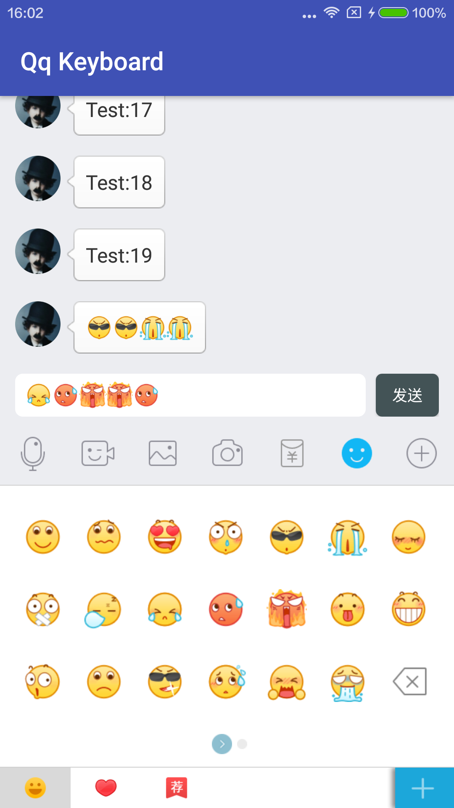
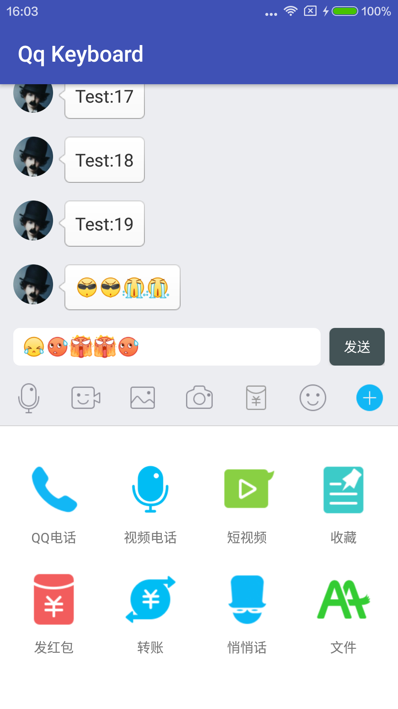
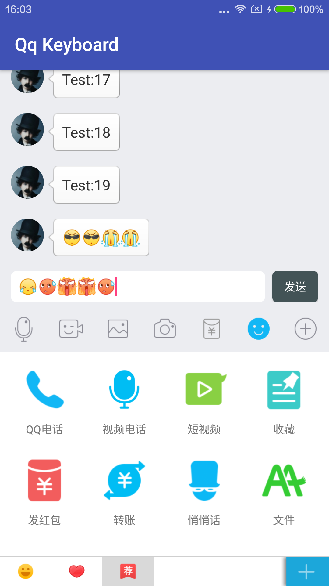
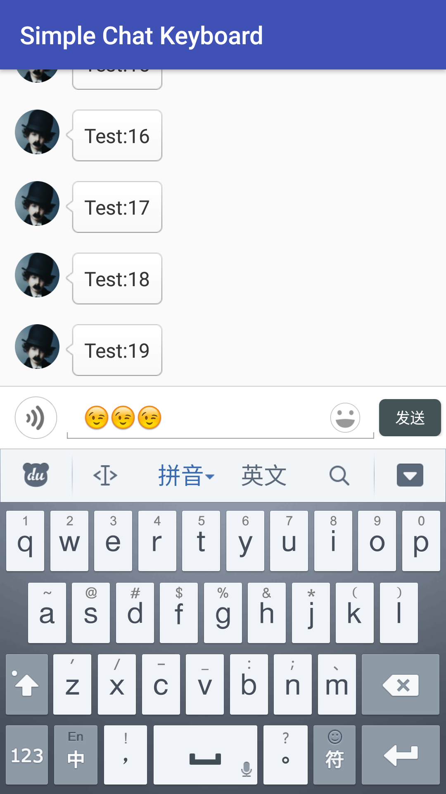
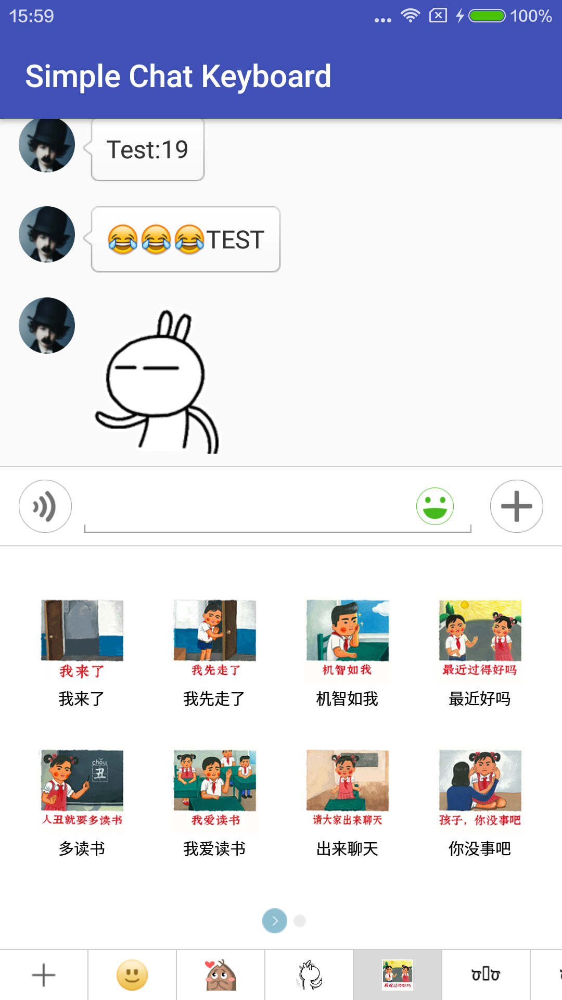
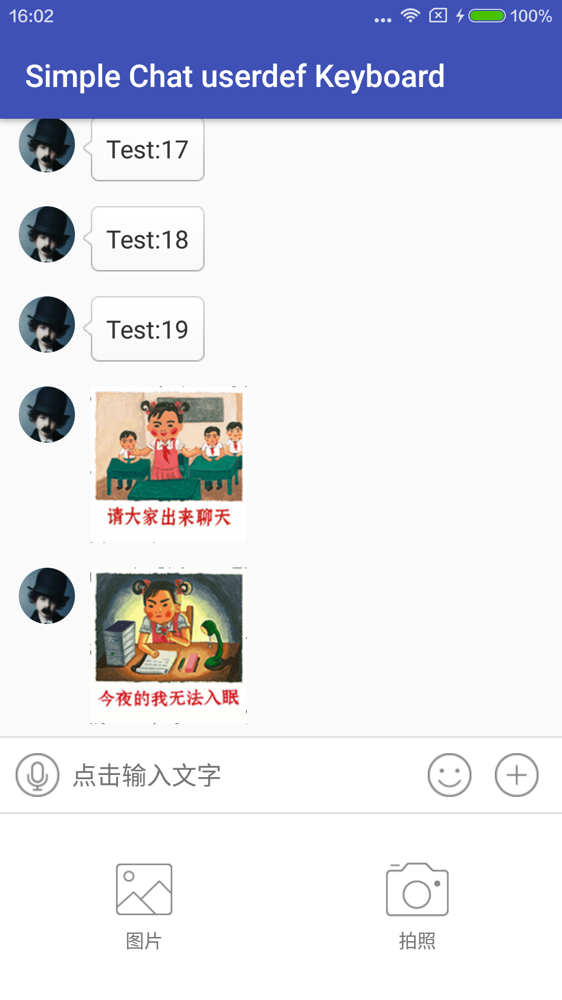
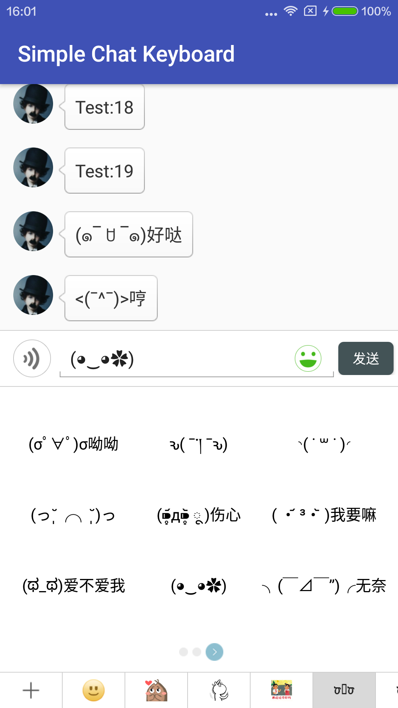
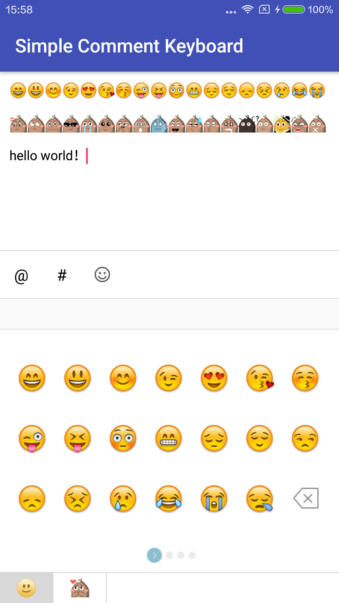
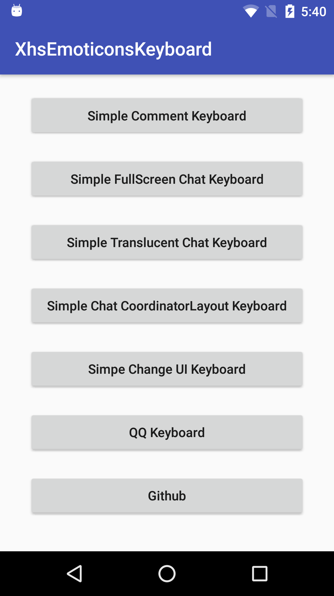
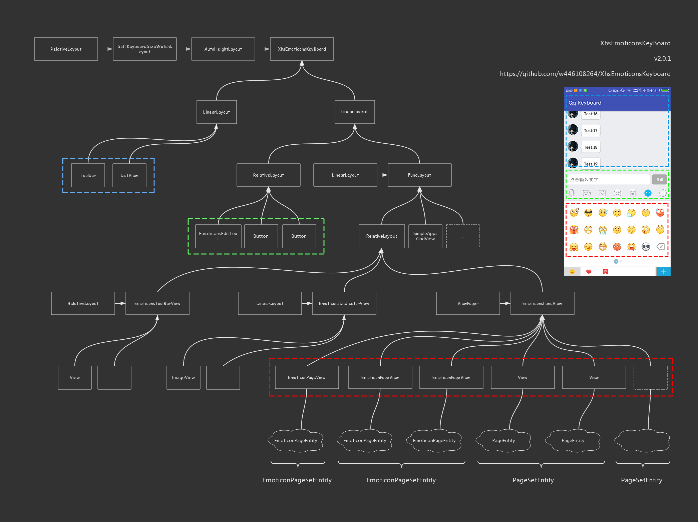

# XhsEmoticonsKeyboard

> j.s 🇨🇳

最良心的开源表情键盘解决方案。

# Features

* API > 9 
* 表情键盘支持无闪烁自跟随系统软键盘高度,及支持自定义高度
* 表情支持自定义格式,支持任意来源
* 组件支持完全自定义,样式支持任意更改
* 支持全屏
* 默认微信键盘样式
* 赠QQ键盘高仿,不谢


 
# Screen Recrod

 
 
 

 
 
 



 
  
 
# Emoji
「[w446108264/AndroidEmoji](https://github.com/w446108264/AndroidEmoji)」


 
 
  
# Samples APK

You can [download a sample APK](https://github.com/w446108264/XhsEmoticonsKeyboard/raw/master/output/simple.apk) 

[Simple2](https://github.com/w446108264/XhsEmoticonsKeyboard/raw/master/output/simple2.apk) 

 

# Gradle Dependency

Users of your library will need add the jitpack.io repository:

```xml  
allprojects {
    repositories {
        jcenter()
        maven { url "https://jitpack.io" }
    }
}
```

and:

```xml
dependencies { 
    compile 'com.github.w446108264:XhsEmoticonsKeyboard:2.0.4'
}
```

# Samples Usage

```xml
<?xml version="1.0" encoding="utf-8"?>
<sj.keyboard.XhsEmoticonsKeyBoard xmlns:android="http://schemas.android.com/apk/res/android"
    xmlns:app="http://schemas.android.com/apk/res-auto"
    android:id="@+id/ek_bar"
    android:layout_width="match_parent"
    android:layout_height="match_parent"
    android:orientation="vertical">

    <LinearLayout
        android:layout_width="match_parent"
        android:layout_height="match_parent"
        android:orientation="vertical">

        <android.support.design.widget.AppBarLayout
            android:layout_width="match_parent"
            android:layout_height="wrap_content"
            android:theme="@style/XhsEmoticonsKeyboardTheme.AppBarOverlay">

            <android.support.v7.widget.Toolbar
                android:id="@+id/toolbar"
                android:layout_width="match_parent"
                android:layout_height="?attr/actionBarSize"
                android:background="?attr/colorPrimary"
                app:popupTheme="@style/XhsEmoticonsKeyboardTheme.PopupOverlay" />

        </android.support.design.widget.AppBarLayout>

        <ListView
            android:id="@+id/lv_chat"
            android:layout_width="match_parent"
            android:layout_height="match_parent"
            android:cacheColorHint="#00000000"
            android:divider="@null"
            android:fadingEdge="none"
            android:fitsSystemWindows="true"
            android:listSelector="#00000000"
            android:scrollbarStyle="outsideOverlay"
            android:scrollingCache="false"
            android:smoothScrollbar="true"
            android:stackFromBottom="true" />
    </LinearLayout>

</sj.keyboard.XhsEmoticonsKeyBoard>

```
demo ->   [Demo](https://github.com/w446108264/XhsEmoticonsKeyboard/blob/master/Simple2/app/src/main/java/com/simple2/MainActivity.java)

```java

        // simple
        // https://github.com/w446108264/XhsEmoticonsKeyboard/blob/master/Simple2/app/src/main/java/com/simple2/MainActivity.java
        // https://github.com/w446108264/XhsEmoticonsKeyboard/blob/master/XhsEmoticonsKeyboard/app/src/main/java/com/xhsemoticonskeyboard/common/SimpleCommonUtils.java
         
        // dot't forget 
        // compile 'com.github.w446108264:AndroidEmoji:1.0.0'
        
        
        final XhsEmoticonsKeyBoard ek_bar = (XhsEmoticonsKeyBoard) findViewById(R.id.ek_bar);

        // source data
        ArrayList<EmojiBean> emojiArray = new ArrayList<>();
        Collections.addAll(emojiArray, DefEmoticons.sEmojiArray);

        // emoticon click
        final EmoticonClickListener emoticonClickListener = new EmoticonClickListener() {
            @Override
            public void onEmoticonClick(Object o, int actionType, boolean isDelBtn) {
                if (isDelBtn) {
                    int action = KeyEvent.ACTION_DOWN;
                    int code = KeyEvent.KEYCODE_DEL;
                    KeyEvent event = new KeyEvent(action, code);
                    ek_bar.getEtChat().onKeyDown(KeyEvent.KEYCODE_DEL, event);
                } else {
                    if (o == null) {
                        return;
                    }
                    String content = null;
                    if (o instanceof EmojiBean) {
                        content = ((EmojiBean) o).emoji;
                    }
                    int index = ek_bar.getEtChat().getSelectionStart();
                    Editable editable = ek_bar.getEtChat().getText();
                    editable.insert(index, content);
                }
            }
        };

        // emoticon instantiate
        final EmoticonDisplayListener emoticonDisplayListener = new EmoticonDisplayListener() {
            @Override
            public void onBindView(int i, ViewGroup viewGroup, EmoticonsAdapter.ViewHolder viewHolder, Object object, final boolean isDelBtn) {
                final EmojiBean emojiBean = (EmojiBean) object;
                if (emojiBean == null && !isDelBtn) {
                    return;
                }

                viewHolder.ly_root.setBackgroundResource(com.keyboard.view.R.drawable.bg_emoticon);

                if (isDelBtn) {
                    viewHolder.iv_emoticon.setImageResource(R.mipmap.icon_del);
                } else {
                    viewHolder.iv_emoticon.setImageResource(emojiBean.icon);
                }

                viewHolder.rootView.setOnClickListener(new View.OnClickListener() {
                    @Override
                    public void onClick(View v) {
                        emoticonClickListener.onEmoticonClick(emojiBean, 0, isDelBtn);
                    }
                });
            }
        };

        //  page instantiate
        PageViewInstantiateListener pageViewInstantiateListener = new PageViewInstantiateListener<EmoticonPageEntity>() {
            @Override
            public View instantiateItem(ViewGroup viewGroup, int i, EmoticonPageEntity pageEntity) {
                if (pageEntity.getRootView() == null) {
                    EmoticonPageView pageView = new EmoticonPageView(viewGroup.getContext());
                    pageView.setNumColumns(pageEntity.getRow());
                    pageEntity.setRootView(pageView);
                    try {
                        EmoticonsAdapter adapter = new EmoticonsAdapter(viewGroup.getContext(), pageEntity, null);
                        // emoticon instantiate
                        adapter.setOnDisPlayListener(emoticonDisplayListener);
                        pageView.getEmoticonsGridView().setAdapter(adapter);
                    } catch (Exception e) {
                        e.printStackTrace();
                    }
                }
                return pageEntity.getRootView();
            }
        };

        // build
        EmoticonPageSetEntity xhsPageSetEntity
                = new EmoticonPageSetEntity.Builder()
                .setLine(3)
                .setRow(7)
                .setEmoticonList(emojiArray)
                .setIPageViewInstantiateItem(pageViewInstantiateListener)
                .setShowDelBtn(EmoticonPageEntity.DelBtnStatus.LAST)
                .setIconUri(ImageBase.Scheme.DRAWABLE.toUri("ic_launcher"))
                .build();

        PageSetAdapter pageSetAdapter = new PageSetAdapter();
        pageSetAdapter.add(xhsPageSetEntity);
        ek_bar.setAdapter(pageSetAdapter);

        class EmojiFilter extends EmoticonFilter {

            private int emojiSize = -1;

            @Override
            public void filter(EditText editText, CharSequence text, int start, int lengthBefore, int lengthAfter) {
                emojiSize = emojiSize == -1 ? EmoticonsKeyboardUtils.getFontHeight(editText) : emojiSize;
                clearSpan(editText.getText(), start, text.toString().length());
                Matcher m = EmojiDisplay.getMatcher(text.toString().substring(start, text.toString().length()));
                if (m != null) {
                    while (m.find()) {
                        String emojiHex = Integer.toHexString(Character.codePointAt(m.group(), 0));
                        EmojiDisplay.emojiDisplay(editText.getContext(), editText.getText(), emojiHex, emojiSize, start + m.start(), start + m.end());
                    }
                }
            }

            private void clearSpan(Spannable spannable, int start, int end) {
                if (start == end) {
                    return;
                }
                EmojiSpan[] oldSpans = spannable.getSpans(start, end, EmojiSpan.class);
                for (int i = 0; i < oldSpans.length; i++) {
                    spannable.removeSpan(oldSpans[i]);
                }
            }
        }
        // add a filter
        ek_bar.getEtChat().addEmoticonFilter(new EmojiFilter());
```

# Else 

 if you want to change the System status bar   
 
 ```java
 
 // like this
 getWindow().getDecorView().setSystemUiVisibility(View.SYSTEM_UI_FLAG_LAYOUT_FULLSCREEN);
 
 // this
 if (Build.VERSION.SDK_INT >= Build.VERSION_CODES.KITKAT) {
     getWindow().addFlags(WindowManager.LayoutParams.FLAG_TRANSLUCENT_STATUS);
}
        
 ```
you should add a Layout on the outside , demo ->   [SimpleTranslucentChatActivity](https://github.com/w446108264/XhsEmoticonsKeyboard/blob/master/XhsEmoticonsKeyboard/app/src/main/java/com/xhsemoticonskeyboard/activity/SimpleTranslucentChatActivity.java)


```xml

<!-- if you change the System status bar -->
<!-- Add a Layout on the outside -->

<?xml version="1.0" encoding="utf-8"?>
<FrameLayout xmlns:android="http://schemas.android.com/apk/res/android"
    xmlns:app="http://schemas.android.com/apk/res-auto"
    android:layout_width="match_parent"
    android:layout_height="match_parent"
    android:fitsSystemWindows="true"
    android:orientation="vertical">
    
    <sj.keyboard.XhsEmoticonsKeyBoard
        android:id="@+id/ek_bar"
        android:layout_width="match_parent"
        android:layout_height="match_parent"
        android:orientation="vertical">
        
        <!-- ... -->
        
    </sj.keyboard.XhsEmoticonsKeyBoard>
</FrameLayout>
    
```

 
 
# Simple Default Keyboard Layout Tree 「 [SVG high definition](http://www.shengjun.red/treeview.svg) 」

 


# Contact & Help

Please fell free to contact me if there is any problem when using the library.

* email: shengjun8486@gmail.com 


